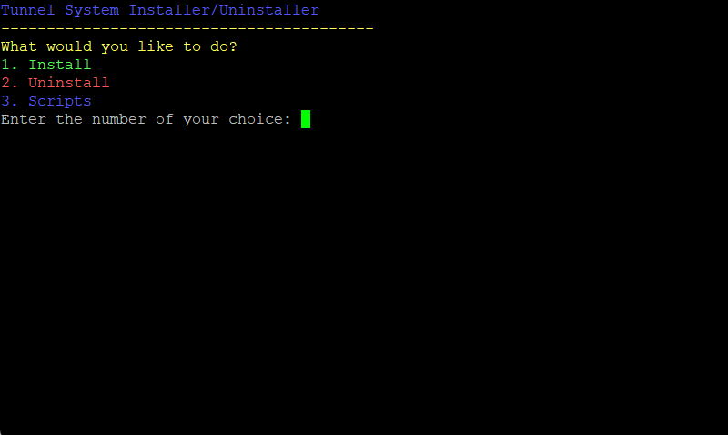
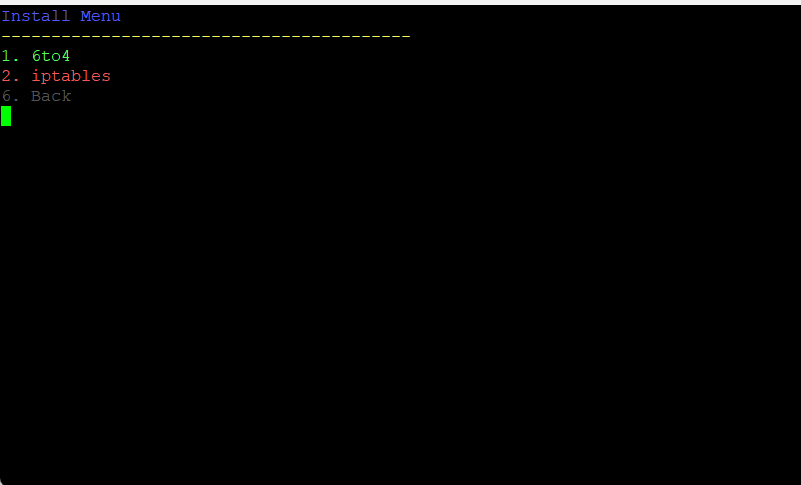
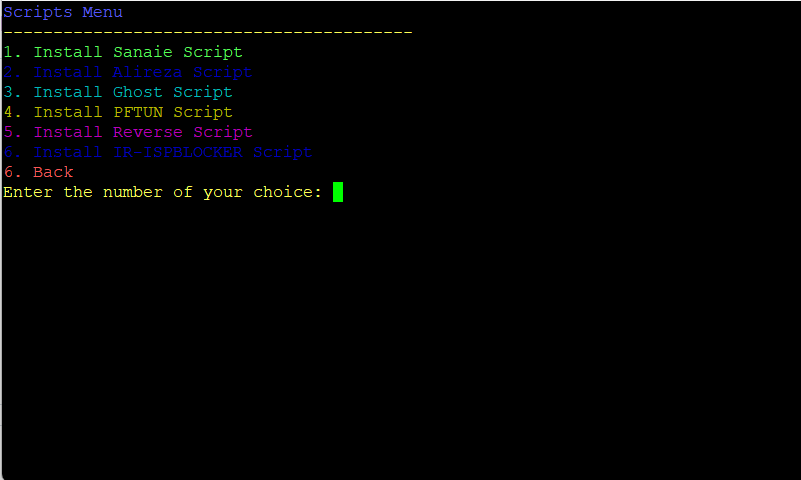

# tunel

**توضیحات :** لطفا قبل نصب حتما سیستم عامل سرور مجازی باید 22 باشد.


برای نصب اسکریپت از دستور زیر استفاده میکنیم!

```
bash <(curl -Ls https://raw.githubusercontent.com/Rezagoodarzii/tunel/master/install.sh)
```
**توضیحات :** برای برقراری تانل ها باید حتما هم در سرور ایران و هم خارج اجرا کنید.

**توضیحات :** برای حذف اسکریپت از روی سرور گزینه 2 را انتخاب کنید و حذف کنید و بعد حذف کردن سرور را حتما ریبوت ```reboot``` نمایید.

توجه داشته باشید که بعد اجرای تانل 6to4 پینگ سرور خارجتون بسته خواهد شد. برای باز کردن پینگ باید اسکریپت را حذف و بعد ریبوت ```reboot``` کنید. 






## چنل تلگرامی

- [chanell](http://t.me/vpns_shop)
